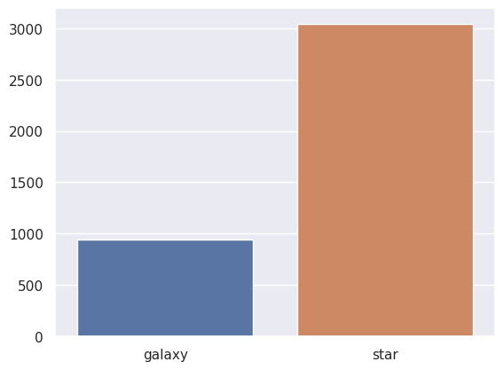
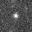
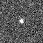
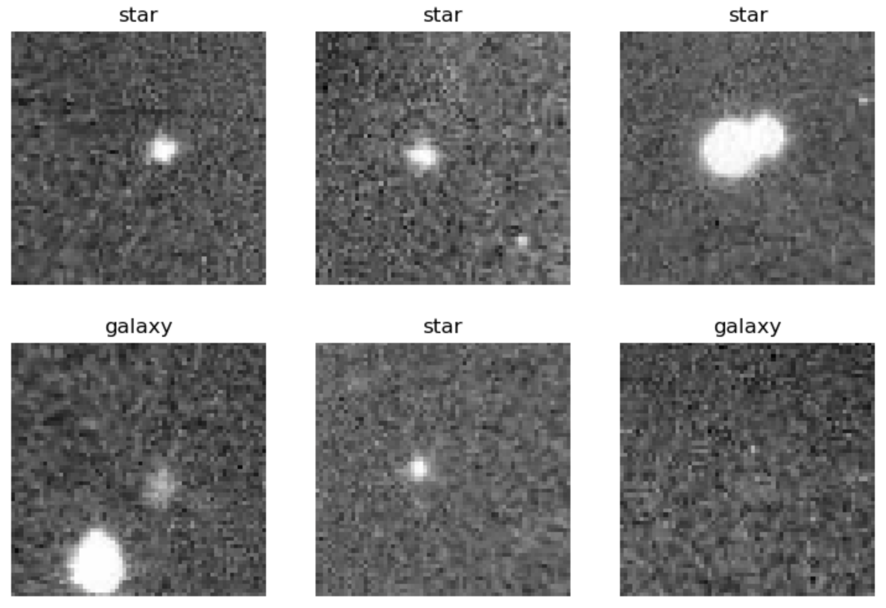
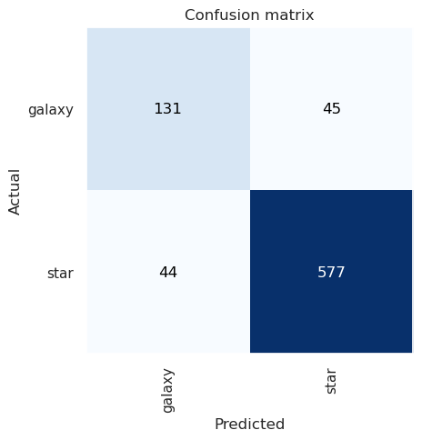
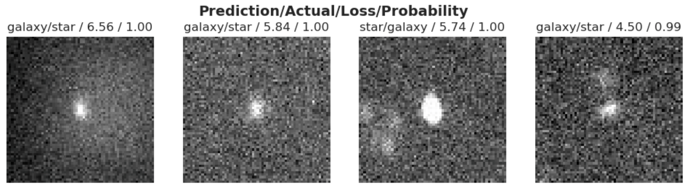

## Introduction

Hey everyone! For my first ever post I wanted to start off with demonstrating
how I trained a relatively simple neural network on a small dataset of star and
galaxy image data. The dataset, [Star-Galaxy Classification Data](https://www.kaggle.com/datasets/divyansh22/dummy-astronomy-data) was collected from an observatory
situated in Devasthal, Nainital, India. Overall the dataset consists of
approximately 4,000 images of stars and galaxies. All of the images have been
resized to a 64x64 cutout to facilitate training of classification algorithms.

In this post I also utilize the [Fast.AI](https://www.fast.ai) library which
provides a simple and intuitive abstraction over PyTorch. It makes data science
much easier.

Now, lets jump into it and begin by setting up our environment.

## Environment Setup

The first thing we want to do is setup our development environment and import
the libraries that we need.

```py
# Import all the modules we will need
import fastbook
from fastbook import *
from fastai.vision.all import *
from fastcore.all import *
import seaborn as sns
import torch

# Set the display options of PyTorch so that it renders better in Jupyter
torch.set_printoptions(linewidth=140, sci_mode=False, edgeitems=7)

# Set the Seaborn theme
sns.set_theme()

# ! We need this to get some of the training output to work. This will be fixed
# in a future release of Jupyter for VS Code.
# https://github.com/microsoft/vscode-jupyter/pull/13442#issuecomment-1541584881
from IPython.display import clear_output, display, DisplayHandle, Image

def update_patch(self, obj):
    clear_output(wait=True)
    self.display(obj)


DisplayHandle.update = update_patch
```

The two key libraries that we import above are the `fastai` and `torch`
libraries which provide all of the deep learning goodies. We also import
`fastbook` which provides some neat features for Jupyter Notebook development.
Lastly, we configure the Jupyter Notebook to dynamically update output so that
we can see it correctly in Visual Studio Code.

That's all we need to dowload our data and begin training our neural network.

## Downloading the Data

Now that we have all of our packages imported and our notebook set up, we can
proceed with downloading our data from Kaggle.

We can start by setting the path to the dataset we will dowload:
```py
dataset_name = "divyansh22/dummy-astronomy-data"
dataset_path = URLs.path(dataset_name)
Path.BASE_PATH = dataset_path
```

You should see the path set to:

```sh
Path('/root/.fastai/archive/dummy-astronomy-data')
```

Now we can actually download the data:

```py
# Download the dataset to a hidden folder and extract it from kaggle
if not dataset_path.exists() or not any(Path(dataset_path).iterdir()):
    import kaggle

    dataset_path.mkdir(parents=True, exist_ok=True)
    kaggle.api.dataset_download_cli(dataset_name, path=dataset_path, unzip=True)
```

You should see that our `dataset_path` contains the following folders:

```sh
[Path('star'),Path('galaxy')]
```

The data is inside of a "Cutout Files" folder. We want to move the files that
are in there to be directly beneath the "dummy-astronomy-data" folder.

```py
if not Path(dataset_path / "star").is_dir():
    shutil.move(Path(dataset_path / "Cutout Files" / "galaxy"), dataset_path)
    shutil.move(Path(dataset_path / "Cutout Files" / "star"), dataset_path)
    shutil.rmtree(Path(dataset_path / "Cutout Files"))
```

To make our lives easier later on we will also create two `Path` variables that
point to our galaxy and star images.

```py
galaxy_data_folder = dataset_path / "galaxy"
star_data_folder = dataset_path / "star"
```

## Exploratory Data Analysis (EDA)

Now that we have our data we can begin exploring, analyzing, and visualizing our data.

Lets start by taking a look at how many samples we have of each class (star, and galaxy) and how many we have in total.



We can see that we have about three times more star images than galaxy images.
This is a pretty significant bias in our dataset that can, and most likely will,
impact the performance of our model. Later on we will implement one technique to
help aleviate some of this bias.

Lets now actually take a look at an image from each of the two classes.

```py
galaxy_img = galaxy_data_folder / Path(galaxy_data_folder.ls()[0])
star_img = star_data_folder / Path(star_data_folder.ls()[0])

display(Image(filename=galaxy_img)), display(Image(filename=star_img));
```

Galaxy             |  Star
:-------------------------:|:-------------------------:
  |  

To the untrained eye these images can appear as just pixelated noise. In reality these images contain some of the most astounding objects in our universe. A neural network should be able to distinguish the two after some training.

### Create the Fast.AI DataLoader

Now that we have our data prepared we can proceed to creating a `DataLoader` object. This object will be used to load our data and pass it into our model for training.

But before we do that lets actually move an image as a holdout to do a quick test after training.

```py
test_folder = Path(dataset_path / ".." / "test")

if not test_folder.exists():
    test_folder.mkdir()
    test_image = galaxy_data_folder / galaxy_data_folder.ls()[0]
    shutil.move(test_image, Path(test_folder / "galaxy.jpg"))
```

Now we can create our `DataLoader` object. The [DataLoader](https://docs.fast.ai/data.load.html) class provided by Fast.AI is essentially a wrapper around the PyTorch
[DataLoader](https://pytorch.org/tutorials/beginner/basics/data_tutorial.html)
that provides additional features and nice abstractions like automatic training
and validation splits.

```py
# With Fast.AI we can easily create a DataLoader via the Datablock
data_loader = DataBlock(
    blocks=(
        ImageBlock,
        CategoryBlock,
    ),  # the inputs to our model are images and the outputs are categories
    get_items=get_image_files,  # to find the inputs to our model run the get_image_files function
    splitter=RandomSplitter(
        valid_pct=0.2
    ),  # split the data into training and validation, 20% of which is for validation
    get_y=parent_label,
    batch_tfms=aug_transforms(
        size=64, flip_vert=True
    ),  # we also apply some image augmentations
).dataloaders(dataset_path, bs=32)
```

The `DataLoader` object we created also shows you a batch of data. Lets take a
look:

```py
data_loader.show_batch(max_n=6)
```



Another great feature of FastAI's `DataLoader` class is that it provides
a set of industry-standard image augmentations. These augmentations, like
horizontal flip or random crop, essentially provide "free" data for your model
to train on. This will be crucial given the limited number of samples we have
for galaxy images.

## Training the Model

Now that we have our data loaded into a `DataLoader` and split into training
and validation we can begin training some models!

First we need to define some hyperparameters. Hyperparameters are like the
high-level knobs that control how your model trains. We'll start with defining
the epochs, which is the number of rounds the model should train on the full
data.

```py
EPOCHS: int = 3
```

We're also gonna be training two models. A baseline ResNet18 and a ConvNeXt model.
Additionally, we'll be using accuracy as our metric to evaluate the performance
of our models.

```py
# A learner is just a wrapper around the model, data loader and metrics
resnet_learner = vision_learner(data_loader, "resnet18", metrics=accuracy)
convnext_learner = vision_learner(data_loader, "convnext_tiny.fb_in22k", metrics=accuracy)
```

You'll notice that we made a [vision_learner](https://docs.fast.ai/vision.learner.html)
instance instead of a straight neural network instance. A `vision_learner` is
another class provided by FastAI that essentially bundles the model architecture,
the data loader, and the metrics. This abstraction facilitates training and
evaluation of our models.

Now lets fine tune our two models!

Wait a minute! What do I mean by "fine tune"? Are we not supposed to be training?
Great catch! What we are actually going to be doing is something called 
[transfer learning](https://en.wikipedia.org/wiki/Transfer_learning). Transfer
learning takes a pre-trained model and trains the very last layer on our new
data. This technique helps improve performance where data is limited.


Lets start by fine-tuning our Resnet18 model:
```py
resnet_learner.fine_tune(EPOCHS)
```

| epoch | train_loss | valid_loss | accuracy | time  |
|-------|------------|------------|----------|-------|
| 0     | 0.763895   | 0.506514   | 0.767880 | 00:54 |
| 1     | 0.664355   | 0.492379   | 0.785445 | 00:57 |
| 2     | 0.608526   | 0.466246   | 0.787955 | 00:57 |

An accuracy of 79%. Not too bad given the small dataset we are working with.
Lets see if our ConvNeXt model does any better.

```py
convnext_learner.fine_tune(EPOCHS)
```

| epoch | train_loss | valid_loss | accuracy | time  |
|-------|------------|------------|----------|-------|
| 0     | 0.573735   | 0.393918   | 0.855709 | 02:30 |
| 1     | 0.497023   | 0.299768   | 0.882058 | 02:34 |
| 2     | 0.414366   | 0.297912   | 0.888331 | 02:35 |

Our ConvNeXt model has an accuracy of 89%. This isn't all too surprising given
that the ConvNeXt architecture is deeper and more complex than the simple
Resnet18 architecture.

### Analyze the Results

With the `vision_learner` we can also take a look at the confusion matrix which
is a handy visualization tool to understand model performance.

```py
class_interp = ClassificationInterpretation.from_learner(convnext_learner)
class_interp.plot_confusion_matrix()
```



Basically everything in the diagonal was classified correctly. We can see that
it classified 44 images as galaxies when they were actually stars and 45 images
as stars when they were actually galaxies.

Lets also take a look at the top losses i.e. the images the model had the most
difficult time classifying.

```py
class_interp.plot_top_losses(4, nrows=1)
```



And we can also take a look at the classification report.

```py
class_interp.print_classification_report()
```

|              | precision | recall | f1-score | support |
|--------------|-----------|--------|----------|---------|
| galaxy       | 0.75      | 0.74   | 0.75     | 176     |
| star         | 0.93      | 0.93   | 0.93     | 621     |
|              |           |        |          |         |
| accuracy     |           |        | 0.89     | 797     |
| macro avg    | 0.84      | 0.84   | 0.84     | 797     |
| weighted avg | 0.89      | 0.89   | 0.89     | 797     |

In the classification report we can again see again that the performance is much better in classifying stars over galaxies. The imbalances of the dataset are showing. The F1 Score demonstrates an approximate 0.2 difference in performance between the two classes.
Also precision and recall are much better for stars than they are for galaxies.

## Improving Our Results

In our first round of experiments we saw that our ConvNeXt model was able to achieve ~88% accuracy. However, the model's performance on the galaxy samples was significantly less than the stars. This is due to the significant class imbalance. A class imbalance can significantly degrade model performance.

In this section we will implement a couple of techniques to fix the class imbalance to improve our model's performance.

### Switch to CrossEntropyLoss

One way that we can improve our performance is by using the [CrossEntropyLoss](https://pytorch.org/docs/stable/generated/torch.nn.CrossEntropyLoss.html).

This loss assigns weights to the classes to help even out an unbalanced dataset.
After a bit of playing around with pairs of weights I found that a weight of
0.8 and 0.2 provided really good results.

```py
weight = torch.tensor((0.80, 0.20))

# Set the loss function as the CrossEntropyLoss 
convnext_learner.loss_fn = nn.CrossEntropyLoss(weight=weight)
```

Now we can fine-tune our model with CrossEntropyLoss.

```py
convnext_learner.fine_tune(EPOCHS)
```

| epoch | train_loss | valid_loss | accuracy | time  |
|-------|------------|------------|----------|-------|
| 0     | 0.279058   | 0.277570   | 0.880803 | 02:45 |
| 1     | 0.267582   | 0.279332   | 0.890841 | 02:37 |
| 2     | 0.252669   | 0.230112   | 0.917189 | 02:46 |

Wow! We can see that CrossEntropyLoss got our model accuracy to 92%! That is not
bad given the very small and imbalanced nature of our dataset.

## Test

Remember that holdout galaxy image we set aside? Lets now grab it and make a prediction on it to do a quick test of our model.

```py
predictions = []

is_galaxy, _, probs = convnext_learner.predict(Path(test_folder / "galaxy.jpg"))

print(is_galaxy, probs)
```

```sh
galaxy TensorBase([0.7543, 0.2457])
```

## Conclusion

In this post I walked you thorugh training a simple neural network on a very
small dataset of approxmiately 4,000 images. We ended up getting some pretty
decent results of ~92% accuracy. Not too bad given the constraints we were
working with.

Thanks for reading and checkout the accompanying [repo](https://github.com/astroesteban/star-galaxy-classification) to run the source code.
